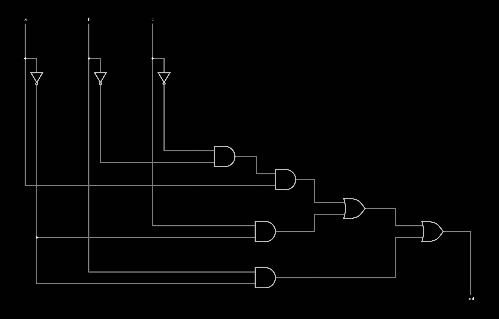
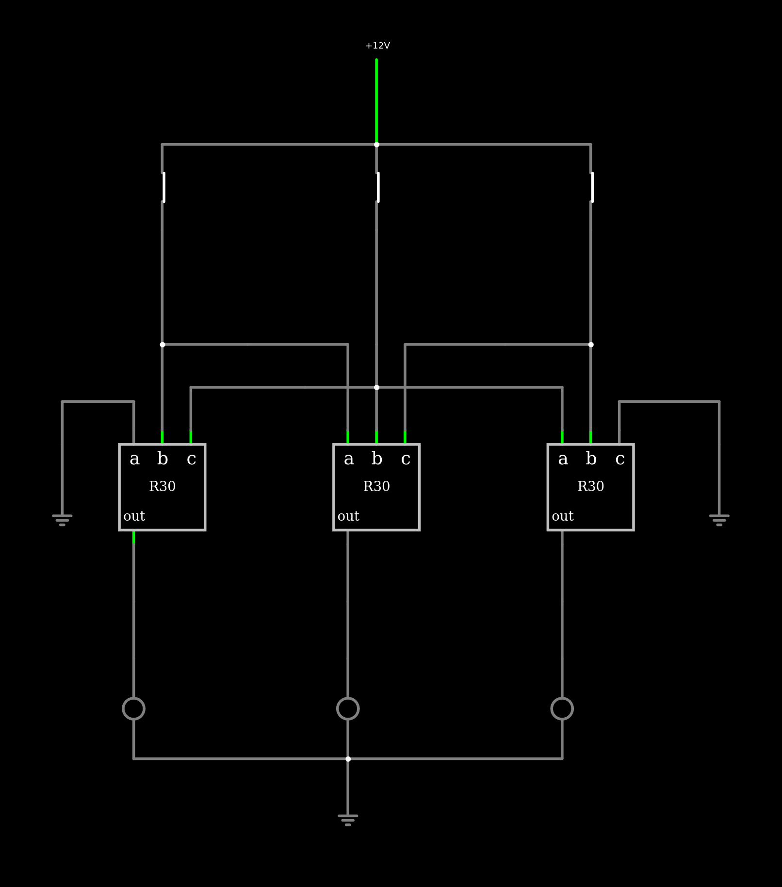
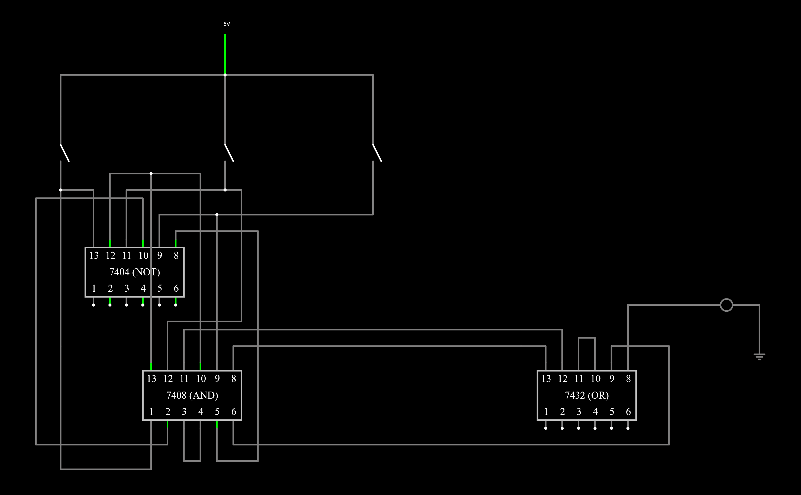

# LCA_automata-celular

## RULE 30

| a | b | c | OUT|
| - | - | - |:--:|
| 1 | 1 | 1 | 0  |
| 1 | 1 | 0 | 0  |
| 1 | 0 | 1 | 0  |
| 1 | 0 | 0 | 1  |
| 0 | 1 | 1 | 1  |
| 0 | 1 | 0 | 1  |
| 0 | 0 | 1 | 1  |
| 0 | 0 | 0 | 0  |

<!---

### Mapa de Karnaugh:

|   | 00 | 01 | 11 | 10 |
|:-:|:--:|:--:|:--:|:--:|
| 0 |  0 |  1 |  0 |  1 |
| 1 |  1 |  0 |  0 |  1 |
-->

### OUT = a'.b + a'.c + a.b'.c'

#### [Simulación](https://tinyurl.com/2whdor7w)

[Simulación de una celda](https://tinyurl.com/3xkusjz4)
