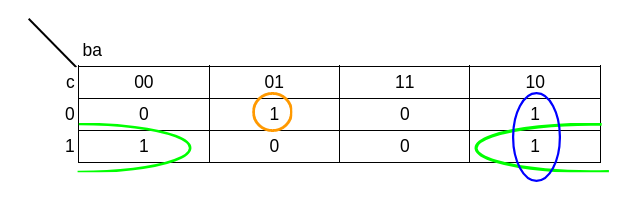
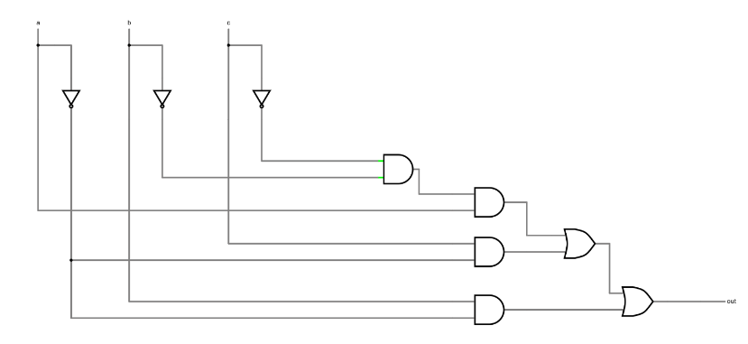
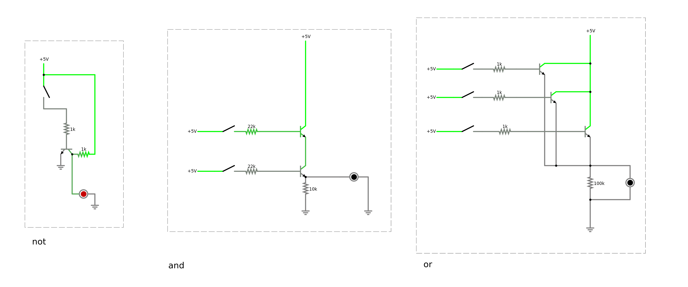
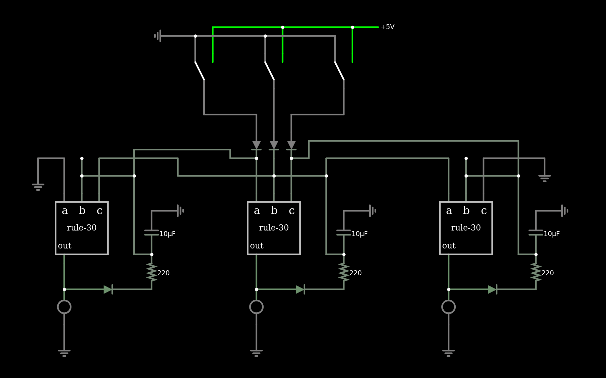
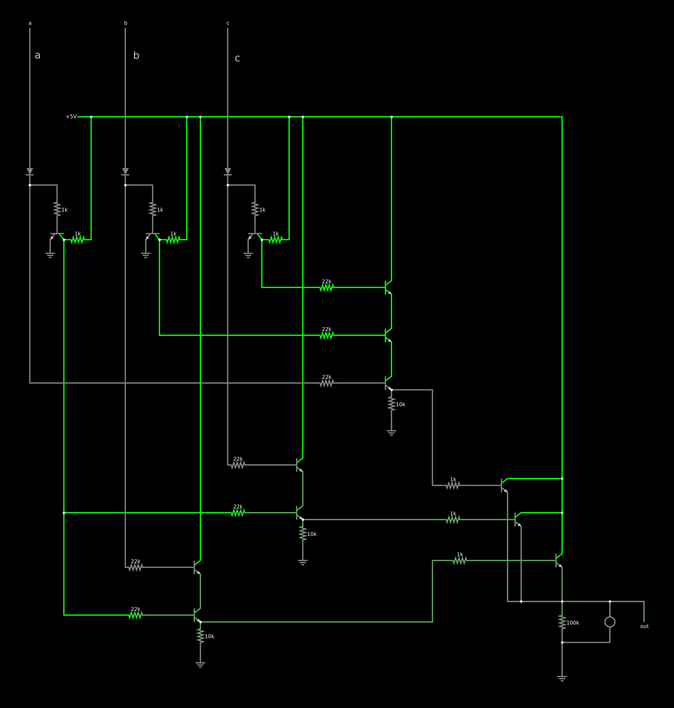

# LCA_automata-celular

## Informe

Se plantea el desarrollo del autómata celular de rule 30 a través de electrónica.

Un autómata celular es un modelo matemático y computacional combinacional. Toma una entrada y mediante una serie de reglas determina una salida. Está conformado por una grilla compuesta de celdas que pueden tomar una cantidad finita de estados. En cada iteración del autómata, el estado de cada celda depende de su estado anterior y el estado de sus “vecinos”, es decir, las celdas contiguas.
El autómata celular más simple consiste en una grilla unidimensional de células que sólo pueden tener dos estados (0, 1), con un vecindario constituido, para cada célula, por ella misma y por las dos células adyacentes.
En este trabajo se toma el autómata de regla 30 como caso puntual, pero lo mismo podría replicarse en otros autómatas de una dimensión.

Como los autómatas son sistemas combinacionales, es decir, sus salidas dependen exclusivamente del valor de sus entradas, puede representarse empleando álgebra de Boole. El primer paso para esto fue realizar la síntesis lógica del autómata elegido. La síntesis lógica es un proceso por el que se obtiene un circuito en términos de puertas lógicas. En este caso se pueden entender las “reglas” del autómata como su tabla de verdad, y a partir de la minimización, se puede simplificar la expresión.
Una vez minimizada la expresión se puede realizar el circuito lógico con compuertas and, or y not para cada celda del autómata.

Teniendo el circuito lógico resuelto se diseña el circuito electrónico utilizando transistores para realizar las compuertas lógicas y utilizando capacitores para generar un delay a la salida de cada celda. Esta celda se retroalimentará a sí misma y a sus celdas vecinas. Puede haber tantas celdas como sean necesarias, siempre y cuando los extremos estén conectados a un vecino en “estado 0” o, lo que es lo mismo, tierra.

El estado inicial del autómata va a determinarse con la presencia humana, pero luego el sistema se retroalimentará y no va a depender de más interacción. Como cada celda tiene una salida que puede tener dos estados, prendido o apagado, pueden utilizarse para encender LEDs, generar pulsos, o encender otros dispositivos o circuitos electrónicos.

La obra tiene entonces dos aspectos importantes. En primera instancia la lógica del autómata, que no es visible. El autómata conocido como regla 30 muestra un comportamiento aperiódico y caótico, genera patrones complejos aparentemente aleatorios. La obra entonces parecerá estar funcionando de manera autónoma y sin reglas evidentes. Un antecedente de esto puede ser la obra Game of Life (2008) de Leo Nuñez. Una instalación interactiva que responde a las reglas de comportamiento de autómatas celulares establecidos por John Conway, a las que él denominó "Game of Life".

La segunda es su materialidad. Se aprovechan los componentes electrónicos para generar una pieza escultórica. Para esto se toman como referencia piezas de Peter Vogel y de Eirik Brandal. El dispositivo se encontrará montado sobre la pared y los espectadores/participantes lo activaran al disponerse frente a él de forma similar a la obra The Sound of Shadows (2011) de Vogel. La presencia (o ausencia) de espectadores frente a cada célula funciona como la semilla inicial del autómata. De esta forma se encenderá la célula si detecta una presencia o se mantendrá apagada si no la detecta. Además, cuando vuelva a detectar movimiento el autómata se reiniciará.

Referencias:
Nuñez, L. (2008). Game of Life. 
https://www.leonunez.com.ar/gameOfLife.html  
Vogel, P. (2011). The Sound of Shadows.
https://vimeo.com/59829961  
Brandal, E. Electronic Sculptures.
https://eirikbrandal.com/

## Anexo

### Síntesis lógica del autómata

A partir de las reglas del autómata se puede definir la siguiente tabla de verdad:

| a | b | c | OUT|
| - | - | - |:--:|
| 1 | 1 | 1 | 0  |
| 1 | 1 | 0 | 0  |
| 1 | 0 | 1 | 0  |
| 1 | 0 | 0 | 1  |
| 0 | 1 | 1 | 1  |
| 0 | 1 | 0 | 1  |
| 0 | 0 | 1 | 1  |
| 0 | 0 | 0 | 0  |

Todos los circuitos combinacionales pueden representarse empleando álgebra de Boole a partir de su función lógica, generando de forma matemática el funcionamiento del sistema combinacional. Esta es:

#### out = a.b'.c' + a'.b.c + a'.b.c' + a'.b'.c

Dónde:
La suma (+) corresponde a una compuerta or
La multiplicación (.) corresponde a una compuerta and
La entrada está negada si está seguida de un apóstrofe (‘)

Es posible simplificar la expresión, para utilizar menos compuertas al describirlo. Uno de los métodos más sencillos (para tan pocas variables) es con Mapas de Karnaugh:

Donde se acomodan los valores de la tabla de verdad. Luego se seleccionan grupos que contengan a los unos del mapa, las áreas deben ser potencia de 2 (1, 2, 4, 8, ...) y se debe tratar de agrupar el mayor número de unos posible. 

De esta forma se obtiene la expresión:

#### out = a'.b + a'.c + a.b.c'

Que se representa:

El circuito es entonces tal para cada celda del autómata. Siendo b la misma celda y a y c sus vecinas.

### Circuito electrónico

Se utilizan transistores para realizar las compuertas lógicas:

[Simulación transistores](https://tinyurl.com/27gn6sy7)

### [Simulación de todo el autómata con 3 celdas](https://tinyurl.com/246u2hgd)

### [Dentro de cada celda](https://tinyurl.com/2aovvxox)
