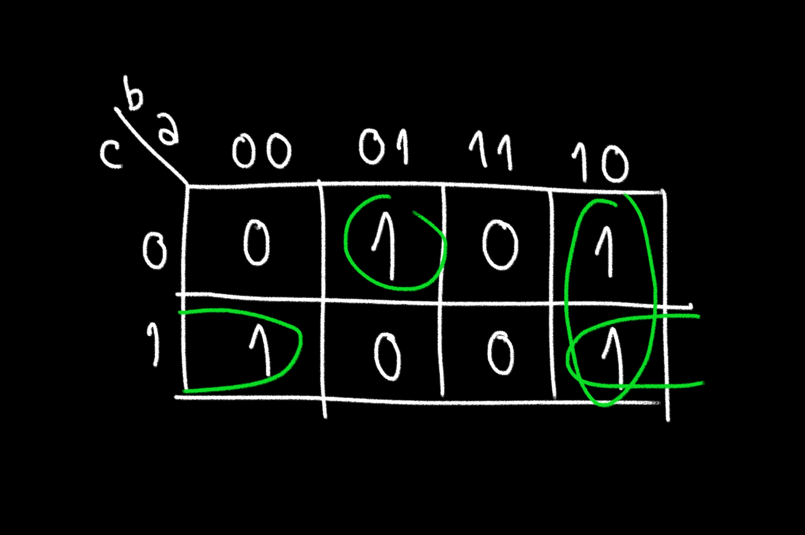

# LCA_automata-celular

## RULE 30

| a | b | c | OUT|
| - | - | - |:--:|
| 1 | 1 | 1 | 0  |
| 1 | 1 | 0 | 0  |
| 1 | 0 | 1 | 0  |
| 1 | 0 | 0 | 1  |
| 0 | 1 | 1 | 1  |
| 0 | 1 | 0 | 1  |
| 0 | 0 | 1 | 1  |
| 0 | 0 | 0 | 0  |

### El resultado es OUT = a'.b + a'.c + a.b'.c' que en compuertas lógicas se traduce a:
<!-- **### OUT = a'.b + a'.c + a.b'.c' -->

<!---

#### [Simulación](https://tinyurl.com/2whdor7w)

[Simulación de una celda](https://tinyurl.com/3xkusjz4)
-->

### [Simulación de todo el autómata con 3 celdas](https://tinyurl.com/246u2hgd)

### [Dentro de cada celda](https://tinyurl.com/2aovvxox)

